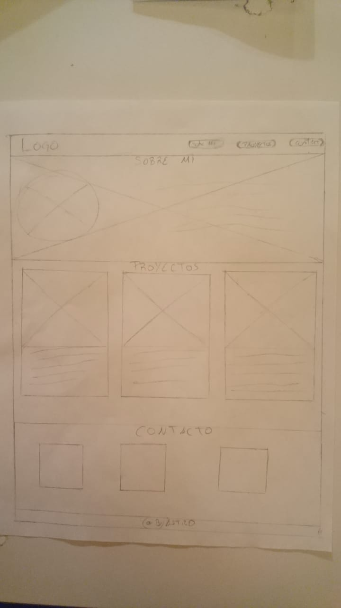
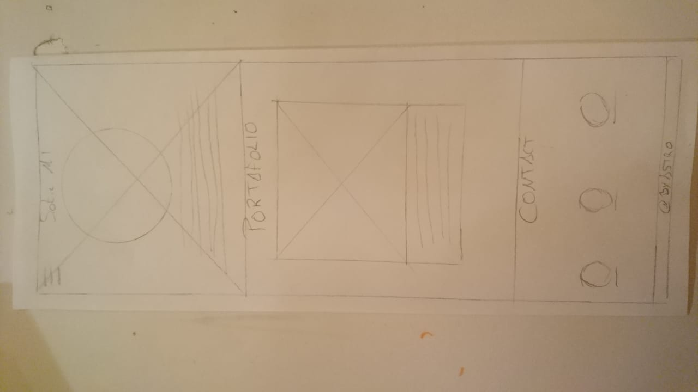

### Links herramientas

[1] http://konpa.github.io/devicon/
[2] https://fontawesome.com/
[3] https://fontface.ninja/
[4] http://www.colorzilla.com/
[5] https://htmlcolorcodes.com/es/recursos/mejor-paleta-de-colores-generadores/
[6] http://www.csslab.cl/etiqueta/efectos/
[7] https://www.campusmvp.es/recursos/post/bibliotecas-de-animaciones-con-css-y-javascript.aspx
[8] https://webirix.com/18-librerias-css-para-crear-animaciones-y-efectos-coquetos/
[9] https://www.creativosonline.org/blog/efectos-css-texto.html
[10] [generadores de paleta de colores](https://es.shopify.com/blog/62615749-14-generadores-de-paletas-de-color-online-para-diseno-web)

### Proceso 

